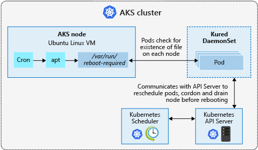
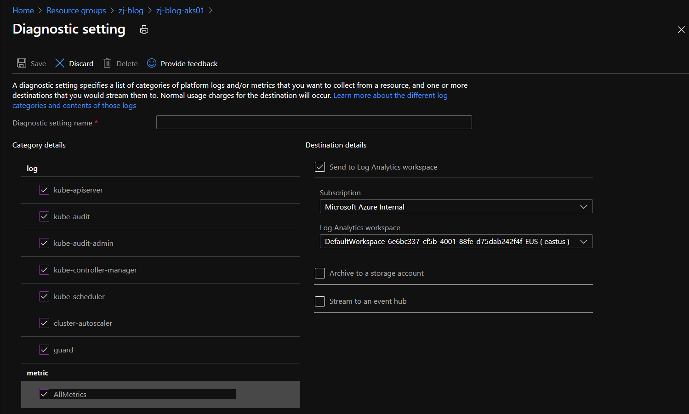
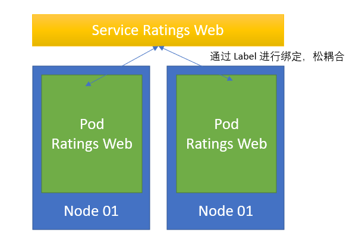

## 利用 Azure Kubernetes Service 部署你的容器服务 - Azure 容器平台尝试 (二)

虽然部署容器有很多种方式，但 Kubernetes 永远是最火的一种. 如果当时只有Docker，没有Kubernetes，也许容器技术及发展趋势与现在会有很大的不同。Kubernetes的出现，弥补了容器数量不断增加，容器间彼此依赖不断复杂，基于容器构建复杂系统时，所需要考虑的高可用、安全、扩展、数据持久化等一系列问题。

最近其实很多文章中，针对Kubernetes的介绍已经从最初的市场教育阶段，例如 `什么是Kubernetes`, `Kubernetes 有哪些组件构成`等基础话题，延伸到 `基于Kubernetes平台构建系统最佳实践的分享`，`如何解决大规模节点的管理`等具体的落地实践，也侧面的证明了，Kubernetes作为容器平台，已经完成了市场的推广教育及验证阶段，正在逐步走向新系统的落地，及原有系统的改造过程。

Kubernetes作为容器编排集群，其管理的核心并没有改变，仍然是容器，过去最流行的莫过于Docker，将来应该主要是containerd（貌似这是最近大家都热议的一个话题）. Kubernetes所起的作用就是针对成百上千的容器以及运行在其中的服务，提出一套实用且扩展性强的管理方案。其实回过头来看，Kubernetes中，能够看得见摸得着的，就是一个个的Pod，里面包含的是一个个的Container，其他所有的资源，如 `Deployment`, `Service`, `StatefulSet` 等，都是逻辑的概念，用来实现对于容器的编排管理.


可以看到，在 Kubernetes 中有大大小小几十种 `Resource` 类型，搞懂这些类型的概念与用途，是用好Kubernetes集群的基础。同时，我们也应该注意到，在开始使用Kubernetes搭建容器平台时，其实会涉及到很多方面，如 `开发工具的集成`, `镜像的生成&管理`, `计算&存储&网络等基础设施的搭建`, `安全`等诸多问题, 有些 Kubernetes 平台提供了实现的方式, 有些需要借助额外的开源项目, 有些需要专业技能的人员进行实现.


短时间上马容器化改造，全靠手工实现是没有办法完成的，这也是越来越多的企业在借助公有云的平台上的托管Kubernetes服务 + 平台提供的PaaS服务来完成。其实，这种扩展性，也体现了Kubernetes作为一款大众接受的容器化平台，他自身的良好移植性。首先，所有云平台中的托管Kubernetes集群，都是基于社区版Kubernetes进行的构建，并随着社区版本的更新而更新（这里需要注意，针对社区版本的Kubernetes，每家云厂商的更新频率及更新策略是不太一样的），并未对Kubernetes核心代码进行任何的更改，所以功能上，与社区保持一直，也就是说，同样一个YML部署资源的文件，跑在任何一家托管的Kubernetes集群上，都应该大差不差，不需要额外的适配；其次，云平台更多的提供了自己的基础设施及PaaS服务，如何更好的适配Kubernetes中的逻辑资源概念，Kubernetes中的逻辑资源，如 `Persistent Volume`，描述了其功能，提供了统一的API，并提供了标准接口，但具体里面存储的Data，是存储在`AWS的EBS`还是存储在`Azure的Managed Disk`里，取决于你的集群部署在哪里。


这种实现方式，其实对于Kubernetes作为中立的社区发展，是有好处的，不受任何一家厂商绑定；对于厂商的是一个变相的鼓励，每个厂商基于Kubernetes提供的标准接口方式，以及其管理理念，适配自己的云平台，也就是说，云厂商投入到开源项目中的越多，用户在用你平台的托管Kubernetes时候，需要自己动手的地方就越少。目前Kubernetes的核心代码库已经将云厂商的代码剥离出去，代码结构有一些变化


上面介绍了这么多，下面将介绍一下，目前在Azure公有云中，提供的 `Azure Kubernetes Service`，当用户想用他的时候，一些实践建议以及可以用到的服务。这篇文章算是一个 DIY 的文章，提供了一个基础的实验参考，里面提到的每一个环节，大家可以自己动手尝试一下。


### 环境准备

本次实验, 将以此 [Azure Kubernetes Service Workshop](https://docs.microsoft.com/en-us/learn/modules/aks-workshop/) 为基础进行练习, 建议大家至少完成到 `Exercise - Deploy an ingress for the front end` 此步骤.

本次实验的场景十分简单, 是一个标准的三层架构，包括了 `API` & `Web` & `MongoDB`, 虽然简单, 但能够实践 Kubernetes 中很多核心资源的概念.


在一些环节的介绍中, 为大家预留了一些课后作业, 相关课后作业的参考文档, 我尽可能多的放在了参考资料中.

### AKS 集群的基础架构

`Azure Kubernetes Service` 作为托管的Kubernetes服务，在集群的创建&维护&管理等方面，给用户提供了很多方便。对于用户，在熟悉Kubernetes是如何工作的前提下，需要了解的是，针对于 `托管` 二字，AKS相比于自建的Kubernetes集群，到底托管了哪些服务：主要托管了 __**Control Plane, 如 API-Server & Controller Manager & Scheduler & ETCD等**__


在一个初期的 AKS 应用架构设计上, 大体上会按照如下的架构进行搭建


AKS中部署的是容器, 容器运行依赖容器镜像, 因此, 一个企业私有镜像仓库是 AKS 项目所必须的. Azure Container Registry 是云上的私有镜像仓库, 与 AKS 是分不开的, 在AKS项目中都会存在. ACR的核心是存储容器镜像,具有一些特性

- 不只支持 `Docker Image`, 还支持 `OCI格式的镜像`, 支持 `Helm Charts`

- 容器镜像的安全性保障, 支持容器镜像扫描, 基础镜像安全更新后自动重新Build镜像，镜像内容认证

- 容器镜像的生成, 一般是通过Dockerfile在本地build好, 再上传到镜像仓库; ACR 支持将 Build Docker Image 的操作扔到云端, 在 ACR 中完成


针对私有镜像仓库, 在拉去镜像的过程中, 需要用户名密码验证身份. 通常的做法是创建一个Secret, 然后在YML文件中使用此Secret. 


AKS与ACR结合比较方便, 通过一条命令可以将AKS集群与ACR连在一起, 后续运行在AKS中的Pod, 在镜像拉取过程中, 无需在YML文件中添加`imagePullSecrets`字段, AKS与ACR连接的命令如下：

`az aks update -n $AKSNAME -g $AKSRG --attach-acr $ACRNAME`

AKS集群的创建过程, 会需要选择一些配置, 建议网络的选择使用 Azure 高级网络插件, 即 Azure CNI, 而非基于`kubenet`的基础Kubernetes网络, 一方面在有些项目中，需要与同一VNET的其他VM或PaaS进行通信, 在同一个网络平面会使连接更加简单, 另一方面, 针对一些高级网络功能, 也只有 Azure CNI能够使用;且在规划每一个Node上Pod的数量时, 需要注意, 默认一个Node的Pod最大值为30, 可以通过CLI在创建时调整此值,建议不要调整过小, 考虑到每一个Node上会存在一些系统Pod, 规划过小会导致一个Node运行不了几个Pod.


在Kubernetes中, Pod的创建销毁是非常随意的, 因此不会直接通过Pod发布服务, 一般都会通过Kubernetes中的资源`Service`完成. 在 AKS 中, 创建 `Service` 时, 可以配置使用 `Internal Load Balancer` & `Public Load Balancer`. 建议使用 `Internal Load Balancer`, 对外发布的服务, 在 Service 前面, 使用 Ingress 进行服务的对外发布. 对于 Ingress Controller, 比较流行的是 `NGINX`, `NGINX` 在 AKS 中可以使用, 通过 Helm, 可以安装NGINX作为Ingress Controller. 但毕竟, 非业务应用部分, 多安装一个服务, 就多了一份运维的复杂度, 在 Azure 平台上, 如果使用 PaaS 服务替换 NGINX 作为 Ingress Controller 的话, `Application Gateway v2` 是一个比较好的选择.

`Challenge : 把实验中使用的NGINX Ingress Controller替换成为Application Gateway; 把实验中提到的MongoDB换成 CosmosDB`

在 AKS 集群内部, 有两个地方是需要根据实际情况进行处理的

- Node Pool : 我们会看到在创建集群的时候, 需要选择机器型号以及操作系统, 会根据用户的选择创建一个 Node Pool, 且 Node Pool 中的机器型号无法更改, 只能更改机器数量. 建议在使用中, 根据实际情况规划 Node Pool, 一个集群中可以包含多个 Node Pool, 例如根据工作负载的不同, 分为 Linux Node Pool, Windows Node Pool, GPU Node Pool等. 这其中有个特别的选项为 虚拟节点, 即`利用Virtual Kubelet + Azure Container Instance`实现的一个逻辑节点, 无CPU&Memory限制, 根据实际需要动态创建删除ACI, 这对于基于事件或批量的任务处理更有效. 建议创建集群时打开, 根据工作负载的内容, 长期运行的仍然部署在 Node Pool 中, 任务型部署在虚拟节点中.


针对不同的Node Pool或虚拟节点的选择, 是在部署Kubernetes资源时, 针对Pod或Deployment的YML文件, 添加限制来实现, 如

```
# 方式一
spec:  
  replicas: 1
  template:
    metadata:
      name: wcfsvc
      labels:
        app: wcfsvc
    spec:
      nodeSelector:
        "beta.kubernetes.io/os": windows

# 方式二
spec:
  containers:
  - image: mcr.microsoft.com/oss/nginx/nginx:1.15.9-alpine
    name: mypod
    resources:
      requests:
        cpu: 100m
        memory: 128Mi
      limits:
        cpu: 1
        memory: 2G
  tolerations:
  - key: "sku"
    operator: "Equal"
    value: "gpu"
    effect: "NoSchedule"
```
- Namespace : 这个部分算是Kubernetes的最佳实践. Namespace在Kubernetes中提供了软隔离, 因此, 针对不同的服务, 比如环境中会存在系统服务, 监控服务, 业务服务, 运维服务等, 分配不同的Namespace, 方便后续的管理.

`Challenge : 创建一个Windows Node Pool, 并运行一个Windows 容器`


### AKS 的运维管理

毕竟AKS是一款PaaS服务, 相比于IaaS中的虚机, 什么都自己来, AKS作为托管服务, 在集群管理运维方面还是提供了蛮多的方便. 


首先, 在功能性上, 前面文章有提到过, AKS是 `Follow Kubernetes Upstream` 的代码及功能变更, 并未对核心代码做任何更改及功能限制, 因此 Kubernetes 中支持的功能, 在 AKS 中的用法相同, 可以使用 `kubectl` 来完成. 用户在使用AKS时, 可能会关心Kubernetes的版本支持程度及更新频率.

Kubernetes 的版本命名规则为 `[major].[minor].[patch]`, 目前版本为 `v1.20.0`, 每三个月会更新一次版本, 并不定时的更新补丁. AKS会紧跟社区步伐, 支持次新版本, 并维持三个大版本及每个大版本中的四个小版本, 同时Kubernetes社区发布一个版本之后, AKS一般会在一个月之后发出此版本的Preview Version.

```
# AKS 支持的版本可以通过如下命令查询
az aks get-versions -l southeastasia -o table
```


升级 AKS 集群需要注意的是, 建议检查支持升级的版本, 且制定好维护窗口. AKS 无法跨版本升级, 即目前如果是1.17, 要先升级到1.18, 再升级到1.19; 因为涉及到节点升级过程中, 节点上Workload的移动, 一方面请注意节点池中的Node不要是1个，尽可能是单数, 如3, 5, 同时部署的服务的Replica个数尽可能大于1, 确保在Pod移动过程中, 服务仍然可用.

另一个用户关心的话题就是AKS集群基础设施的安全性. 针对Kubernetes Control Plane, 安全补丁及OS补丁对用户来说是透明的; 对于 Work Node, AKS 提供了安全优化过的 VM Image, 且不支持用户自行选择. AKS会对VM进行Daily的安全及OS补丁, 有些更新需要重启机器, AKS并不会主动重启机器, 用户可以通过`kured`来完成检查目前环境中需要重启的节点, 并按照步骤进行重启. 



AKS针对集群的管理，提供了一些便捷的服务, 如下图


如 `Node Auto-repair`, 在 AKS 中, Work Node 会有自己的状态, 正常情况下其状态都是Ready, 这样集群中的Scheduler才会向此Node安排Pod, 集群才可以针对这个Node进行管理.


当 Node 的状态变为 Not Ready 或者为 Unknown 时, 就说明此 Node 除了一些问题. 那针对 `Node Auto-repair`, AKS集群会不断的轮询Node的健康状况, 当10分钟没有回应或状态不Ready超过10分钟, AKS会自动采取动作对此Node进行修复, 动作包括: `重启此节点` & `如果不成功, Reimage此节点` & `如果仍然不成功, 创建一个新的节点.`

Azure Advisor 同样适用于 AKS 集群, 能够从 `性能` & `高可用` & `安全方面` 分析 AKS 集群的配置及使用情况, 并提供可参考的建议.

针对实验中提到的集群, 我们可以查看一下目前有哪些建议


能够看到, 针对现有环境, 还是有很多值得改进的空间, 点击进入每一条建议, 都会有相对应的Step by Step的整改方式及涉及到的资源, 部分整改方式提供了一键执行的操作


同样, 除了建议, AKS集群还提供了相关的诊断服务, 大家可以理解为一个脚本或检查列表, 会提供内置的一些选项, 当我们在使用集群时出现了一些问题, 可能网络连接不通, 节点挂了等问题, 但不知如何下手, 可以利用 AKS 诊断服务, 辅助来完成一次检查.


在此Demo中, 点击 `Node Health` , 可以看到, 经过一段时间的运行, 就会出来一个检查报告, 这个检查报告能够帮助我们评估现有集群的各项指标, 并辅助我们完成修复集群工作.


其实对于集群的运维管理人员, 能够实时了解AKS集群中, 服务的运行状况是非常必要的, 这是衡量业务应用稳定的前提. 


在 Azure 中, 我们都知道, Azure Monitor 是用来集中提供云平台监控的统一入口, 监控信息的查看, 告警信息, 日志信息都可以通过 Azure Monitor 来获取. Azure Monitor同样针对一些服务, 提供了监控的解决方案, 就包括针对 AKS 的, 即 `Azure Monitor for Container`.


在这里, 我们能够了解集群的使用情况, 查看每个Pod的实时日志, 以及部署的相关信息, 除此之外, Kubernets的社区中, 监控解决方案大部分都是围绕着Promethues进行构建的, Promethues中的监控数据和监控力度与平台提供的可能会有一些差别, 但可以将Prometheus的监控数据通过OMS Agent的方式, 导入到Azure Monitor中一并查看管理, 更多的细节可参考 [将 Prometheus 监控指标整合到 Azure Monitor, 丰富AKS监控](https://mp.weixin.qq.com/s?__biz=MzU0OTY0NDE1NA==&mid=2247484259&idx=1&sn=180005b59eecb7bd10e1e575920f82cf&chksm=fbadf176ccda786087763bfb9a8d5c3a903dccaa51ec5b48b4a3d3d0ebb8fe77d1ae992191d2&token=745664942&lang=en_US#rd)


最后叮嘱一点的是, 在创建集群之后, 可以根据实际的需求, 配置诊断日志. 因为很多用户需要的 `Control Plane` 日志, `Kubenetes Audit Log` 以及集群的一些Advanced Metrics, 默认是没有enable的, 需要通过诊断日志进行 Enable, 可以存在 `Log Analytics` 中.


 
当然，并不是每个用户的集群中, 运行的应用都是自己开发的. 当在使用AKS的公司有开发团队, 或需要对AKS中部署的服务进行快速迭代部署, AKS也同样提供了端到端工具的选择, 利用无论是 Azure Pipelines 还是 Github Action, 都可以实现用户的自动化部署发布流程, 再结合 Azure Monitor & Azure Policy等服务, 实现 DevSecOps 中 `持续集成` & `持续发布` & `持续监控`等多个环节.


### AKS中应用服务的可用性

当我们将服务部署在 Kubernetes 集群中, 最关注的就是应用服务的可用性及集群的扩展性. 在 IaaS 时代, 我们部署应用会使用集群的方式, 即利用冗余的方式,通过部署多个虚机资源来实现应用的高可用, 避免单点故障. 这个概念在Kubernetes中同样适用, 只不过在Kubernetes这个部分的实现是通过 `Service` & `Deployment`来实现, 通过`Deployment`中的Replica数量, 控制Pod的数量实现冗余, 并通过 Affinity 设置Pod的分布, 避免同一个服务两个Pod部署在同一个Node, 如果Node出现问题, 服务还是存在风险.



另外一个Kubernetes的特性就是其自愈的能力, 说的有点夸大, Kubernetes会监测环境中的Pod状态,确保其数量及运行状态与YML文件定义的一致. 当Pod被人为删掉, 系统会自动创建一个新的Pod出来, 并对接相关资源, 这也在另一方面确保了服务的可用性.

除了Kubernetes自身的特性确保应用的可用性之外, AKS同样提供了一些能力来帮助提升应用的可用性.


可用性的另外一个表现是当应用的访问量突然上来时, 集群的自动扩展能力. 在这一方面, 针对运行于 Node Pool 中的应用, 主要是利用 `Cluster Autoscaler` + `Horizontal Pod Autoscaler` 来实现的. `Horizontal Pod Autoscaler`主要扩展Pod的数量, 但Pod的创建前提是环境中得有可用的Node供他Schedule，所以需要`Cluster Autoscaler`来扩展Node得数量.


#### 这里的任务是针对现有的集群及服务, 确保Pod的数量大于1，并开启Cluster Autoscaler & Horizontal Pod Autoscaler

针对部署在 Virtual Node 中的应用, 主要利用 Virtual Node 的特性, 可以结合`Horizontal Pod Autoscaler` & KEDA 按需扩展所需资源, 个人认为, 针对Virtual Node，再应用类别上, 可能更偏重于任务型或基于事件响应的服务, 不需要长期运行, 感兴趣的小伙伴可以参考[KEDA - 基于 Event 完成 AKS 中服务能力从0到N的自动伸缩](https://mp.weixin.qq.com/s?__biz=MzU0OTY0NDE1NA==&mid=2247484281&idx=1&sn=a6d7206e9120a686cc872010251ba030&chksm=fbadf16cccda787a97c5a74fe0ebcc2bcab3ecde6263cb559d9c017eb9742554adb83e5c953f&token=745664942&lang=en_US#rd) 


### AKS中的安全

这一部分大家相信都很好奇, 针对 AKS, 各方面的安全能力利用Azure云上的哪些服务. 在这一部分我们看到, 架构图会有一些更新.


从云端治理的角度, AKS的安全第一步, 是利用 Azure Policy 规范AKS集群的使用. 在开源社区, 同样存在着类似的需求, 实现方式是通过 `OPA Gatekeeper` 来实现的. Azure Policy对于AKS集群的治理是依托于 `OPA Gatekeeper` 来完成的. 在 Azure Policy 中, 内置了很多关于 Kubernetes 的Policy.


默认AKS集群中, Azure Policy的插件是关闭的, 可以通过一条命令完成Enable操作, 接下来大家可以按照任务尝试一下Azure Policy的使用.

`az aks enable-addons --addons azure-policy --name zj-blog-aks01 --resource-group zj-blog`

`Challenge : 针对现有集群, 开启 Azure Policy Addon, 并选择一个Policy Assign给集群`

Azure AD RBAC 与 Kubernetes RBAC 进行整合已经并不是一个新鲜的话题, 从 AKS 流行开始, 这个功能就在支持. 除此之外, 现在可以利用AKS集群中`AKS-managed Azure Active Directory integration`的功能, 更好的将 Azure AD, 甚至 Azure Managed Identity 与 Kubernetes 做到更好的集合. 开启这个功能非常的方便, 只需要在集群中点击一下即可


也很容易理解, 在一个集群中, 当人多手杂的时候, 我们就可以利用 Azure AD 的用户账号, 限制开发人员访问的Namespace以及运维人员访问的Namespace. Azure AD在这里面起到两个作用, 就是身份验证, 在操作Kubernetes集群之前, 利用Azure AD证明你是你, 另外一个功能是授权验证, 利用RBAC的概念设置, 限制用户能够访问到的资源. 设置好后, 当我们再去运行 Kubernetes 命令时, 会提示需要 AAD 验证.


AKS集群在网络连接性上提供了几种选择. 首先对外发布的服务, 通过Ingress Controller进行控制, Ingress Controller利用 Application Gateway v2 实现, 并开启 Web Application Firewall 功能, 实现应用访问的安全.

AKS提供了针对访问集群IP的控制, 对于想要连接到 `Kubernetes API-Server` 的IP, 能够进行限制


因此, 对于集群的管理, 尤其是安全性要求比较高的一些用户, 一个比较好的做法是, 限制 API Server 的访问, 只允许通过本地内网IP或云上内网IP进行访问, 并通过 Azure Bastion, 充当跳板机, 对集群进行访问管理. 因为在整个 Kubernetes 集群中, API Server 的中邀请毋庸置疑, 所有的操作, 所有的组件都是通过API Server进行通信的, 因为管理API Server的访问也是一个需要考虑的事情.


对于专有集群要求的用户, AKS 能够通过 Private Link 直接将AKS变为专有集群, API Server 将只提供内网访问地址, 用户可以通过`Azure Bastion`实现集群的连接管理, 本地需要与集群进行连接交互时，可以使用VPN或专线方式, 更多内容可参考 [借助 Private Link 实现 AKS 集群的私有化访问](https://mp.weixin.qq.com/s?__biz=MzU0OTY0NDE1NA==&mid=2247484298&idx=1&sn=834c0d5749c45556011a5af0e2b2cbff&chksm=fbadf19fccda788943363610747f8267eeb480837a51444d4fa94c56cb1da9c8a08f178d6a05&token=745664942&lang=en_US#rd)

在 Kubernetes 集群中, 不可避免的会涉及到的一个话题就是密码的存储, 在我们的这个案例中, 连接 Cosmos DB 需要用到 Connection String, 这里面会涉及到连接 Cosmos DB 的验证信息, 这个时候存在哪里是个问题, 肯定不可能放在明文存在YML里面. Kubernets 提供了一个资源叫 Secret, 可以用来存储集群中所有 Credentials 信息, 存储的信息将会保存在ETCD中, 以Base64加密的方式保存. 当然, 在云平台上都会有密钥存储的服务, 如 Azure Key Vault, 能够与 Secret 对接, 最终使应用需要的 Credentials 存储在 Azure KeyVault 中, 且如今, 平台上的很多PaaS服务, 都能够与 Managed Identity 做集成, 代替以往的Service Principal的方式, 确保密码不会显示, 更加的安全.


`Challenge : 大家可以尝试通过 Azure Keyvault 与 Kubernetes Secret进行整合, 将 Kubernetes Secret中保存的CosmosDB的连接字符串保存到 Azure Keyvault中`

同时, 对于 Azure 上的部分PaaS服务，如 Azure SQL, 利用 `Managed Service Identity`, Pod能够直接与Azure服务进行通信, 进一步减少了配置的难度.


安全放在最后一点说的就是 `Azure Security Center`. 大家都知道 Azure Security Center 是整个Azure云平台安全监控的统一入口, 他能够针对多个workload进行安全评估, 风险提示等安全功能. 在 Azure Security Center 覆盖的workload中, 就包含AKS. 利用 Security Center, 我们能够知道AKS集群目前做的好不好，有哪些不到位的地方, 可以按照紧急程度以及相关的建议进行更新.


以上就是走马观花的罗列了一下 AKS 中我认为用的比较多的地方, 希望对大家有所帮助.


### 参考资料

- [MSLearn - Azure Kubernetes Service Workshop](https://docs.microsoft.com/en-us/learn/modules/aks-workshop/)

- [Secure pods with Azure Policy](https://docs.microsoft.com/en-us/azure/aks/use-pod-security-on-azure-policy)

- [Azure Kubernetes Service solution journey](https://docs.microsoft.com/en-us/azure/architecture/reference-architectures/containers/aks-start-here)

- [Tutorial: Enable Application Gateway Ingress Controller add-on for an existing AKS cluster with an existing Application Gateway through Azure CLI (Preview)](https://docs.microsoft.com/en-us/azure/application-gateway/tutorial-ingress-controller-add-on-existing#code-try-0)

- [Tutorial: Configure and run the Azure Key Vault provider for the Secrets Store CSI driver on Kubernetes](https://docs.microsoft.com/en-us/azure/key-vault/general/key-vault-integrate-kubernetes)